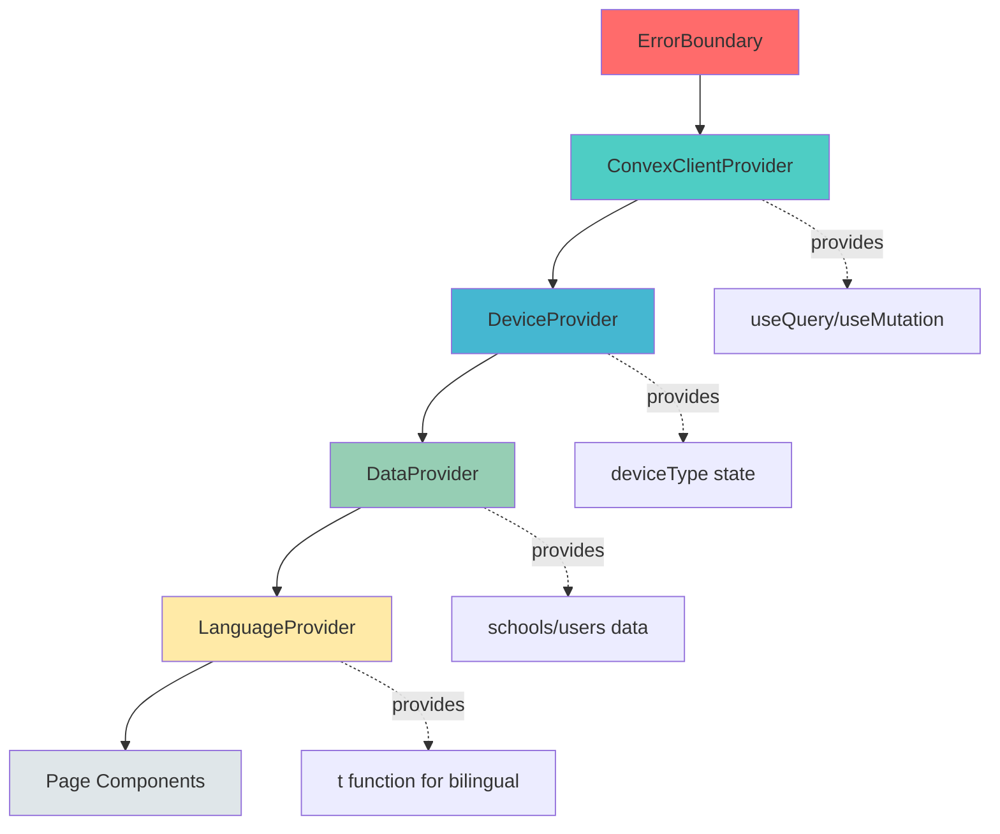

# Architecture Essentials

[← Back to Index](../copilot-instructions.md)

---

## Provider Hierarchy (Load-Bearing - DO NOT REORDER)

Provider order in `app/layout.tsx` is **CRITICAL** - reordering causes runtime failures:

```tsx
<ErrorBoundary>              // 1. Catches all errors
  <ConvexClientProvider>     // 2. DB connection
    <DeviceProvider>         // 3. Device detection (depends on Convex)
      <DataProvider>         // 4. Shared data layer (schools, users)
        <LanguageProvider>   // 5. UI-only state (innermost)
```

**Visual dependency flow:**



All components need `"use client"` directive. Never reorder or remove these providers.

---

## Convex Backend Pattern

- **Schema is source of truth**: `convex/schema.ts` defines tables, indexes, and validation
- **Never edit** `convex/_generated/` - auto-regenerated from schema
- **Client pattern**: `useQuery(api.users.list, {})` for reads, `useMutation(api.classes.book)` for writes
- **Pass userId explicitly** - no built-in `ctx.auth.getUserIdentity()`, uses custom session auth
- **All components require `"use client"`** - Next.js App Router requires this for client-side hooks

---

## Authentication & Session Management

**Custom authentication** (not Convex built-in auth):

```tsx
// Session stored in localStorage with 24-hour expiration
import { saveUserSession, loadUserSession, clearUserSession } from "@/lib/session-utils";

// On login - saves with auto-expiration
saveUserSession(user);

// On page load - validates expiration
const user = loadUserSession(); // Returns null if expired

// On logout
clearUserSession();
```

**Session security features**:

- **24-hour auto-expiration**: Sessions expire after 24 hours (NEW Oct 2025)
- **Auto-extension on activity**: Each page load resets the timer
- **Default password**: `Teacher{username}` (e.g., `TeacherEvan`)
- **First login**: Forced password change via `requirePasswordChange` flag
- **Admin powers**: Create/reset passwords, cannot view existing passwords
- **Password hashing**: Uses bcrypt (industry-standard, 10 rounds) with hybrid verification during migration from legacy btoa() hashes (NEW Nov 2025)
- **Account lockout**: 24-hour lockout after 5 failed login attempts (see Pattern #11)

---

## Database Schema Structure

**Source of truth**: `convex/schema.ts`

### Key Tables

**users**

- Roles: `admin` (God mode), `moderator` (school-scoped), `teacher` (multi-school), `guardian` (private tutoring)
- Device tracking: `deviceType` (desktop/mobile/tablet)
- Login security: `failedLoginAttempts`, `accountLockedUntil`, `lastSuccessfulLogin`
- Indexes: `by_username`, `by_school`, `by_role`, `by_device_type`

**classes**

- Status machine: `pending` → `acknowledged` → `approved`/`rejected`
- Guardian auto-approve: `isGuardianLinked: true` bypasses moderator
- Edit audit trail: `editHistory` array tracks all changes
- Indexes: `by_teacher`, `by_school`, `by_student`, `by_status`, `by_scheduled_date`, `by_school_and_date`, `by_teacher_and_date`

**students**

- Dual ID generation: School-based vs Guardian-based (see Pattern #7, #15)
- School students: `SCHOOLHASH-NAMEHASH-TIMESTAMP-RANDOM`
- Guardian students: `AREA-NAMEHASH-BIRTHDATE-RANDOM`
- Indexes: `by_student_id`, `by_school`, `by_guardian`, `by_guardian_id`, `by_area`

**notifications**

- System-generated (not user-initiated)
- Auto-created by mutations (class booking, student creation, etc.)
- One-way communication (no replies)
- Real-time unread badge updates

**messages**

- User-initiated (not system-generated)
- File attachments supported via Convex Storage
- Read receipts via `acknowledgedBy` array
- Direct (1-to-1) and group (school-wide) messages

---

## Next Steps

- **Learn core patterns** → [Non-Negotiable Patterns](./03-patterns.md)
- **Understand integrations** → [Integration Points & Architecture](./04-integration.md)
- **Review security** → [Security Considerations](./05-security.md)

---

[← Back to Index](../copilot-instructions.md)
