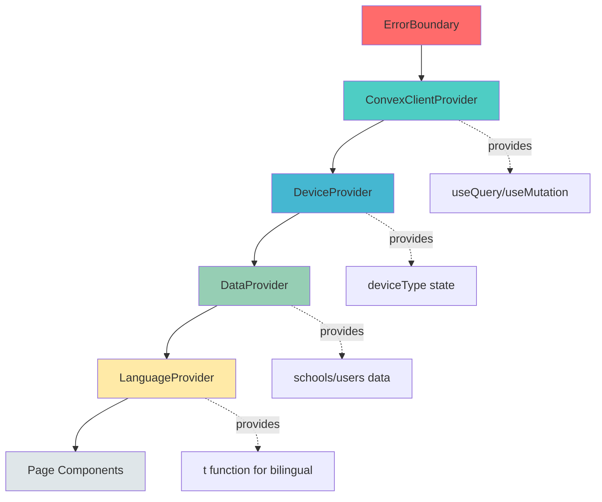

# AI Agent Instructions - Evan's Class Tracker 4.5

> **Version:** 4.5.4  
> **Last Updated:** October 27, 2025  
> **Codebase:** Next.js 15 + React 19 + Convex + Tailwind v4  
> **Instructions Version:** 2.4 (Added Error Reporting pattern, fixed security contradictions)

Bilingual (English/Thai) class tracking system built with **Next.js 15**, **React 19**, **Convex** real-time backend, and **Tailwind v4**. Recent optimizations (Oct 2025) achieved **40-50% faster loads** and **10-100x faster queries** via N+1 elimination.

---

## 🚀 Quick Start for AI Agents

**If you only read 5 things, read these:**

1. **NEVER reorder providers** in `app/layout.tsx` - the hierarchy is load-bearing (ErrorBoundary → ConvexClientProvider → DeviceProvider → DataProvider → LanguageProvider). Reordering causes runtime failures.

2. **Everything is bilingual (English/Thai)** - Schema has `title` AND `titleTh`. Forms need parallel inputs. Use `BilingualInput` component. Validation: `&&` (AND) not `||` (OR) for optional fields.

3. **Always use `.withIndex()`** for Convex queries - check `convex/schema.ts` for indexes. NEVER query inside loops - use batch fetch + Map pattern. This is critical for performance.

4. **Custom auth, not Convex built-in** - Uses localStorage sessions (24hr expiry), `btoa()` password hashing (⚠️ NOT production-secure), and explicit userId passing. See `lib/session-utils.ts`.

5. **All components need `"use client"`** - Next.js App Router requires this directive for client-side hooks (`useQuery`, `useMutation`, `useState`).

**Start Convex FIRST**: `npx convex dev` (must be running before `npm run dev`)

---

## 📑 Table of Contents

**Quick Access:**
- [🚀 Quick Start for AI Agents](#-quick-start-for-ai-agents) - Read this first!
- [Architecture Essentials](#architecture-essentials) - Provider hierarchy, Convex patterns, auth
- [Non-Negotiable Patterns](#non-negotiable-patterns) - 17 critical patterns with examples
- [Development Workflow](#development-workflow) - Build, test, deploy
- [Testing Guide](#testing-guide) - Manual & E2E testing
- [Common Pitfalls](#common-pitfalls) - What NOT to do
- [Key Files Reference](#key-files-for-reference) - Where to find things
- [⚡ Quick Reference Card](#-quick-reference-card) - Copy-paste patterns

**Patterns by Category:**
- **Bilingual:** [#1 Bilingual Development](#1-bilingual-first-development), [#2 Validation](#2-bilingual-validation-pattern-critical---updated-oct-2025)
- **Performance:** [#3 Index Queries](#3-index-first-queries-performance-critical), [#4 N+1 Prevention](#4-avoid-n1-query-problems)
- **Security:** [#11 Login Security](#11-login-security-pattern-account-lockout), [#12 Bulk Deletion](#12-bulk-deletion-pattern-security-critical), [#13 Audit Logging](#13-audit-logging-pattern)
- **Workflows:** [#8 State Machine](#8-class-booking-state-machine), [#14 Cycle Editor](#14-teacher-cycle-editor-pattern-new-oct-2025), [#15 School Management](#15-school-management-pattern-new-oct-2025)
- **UI Components:** [#16 Hierarchical Student Selector](#16-hierarchical-student-selector-pattern-new-oct-27-2025)
- **Error Handling:** [#17 Error Reporting](#17-error-reporting-pattern-new-oct-27-2025)

---

## Quick Start Context

### Tech Stack
- **Frontend**: Next.js 15 + React 19 (App Router)
- **Backend**: Convex (real-time serverless)
- **Styling**: Tailwind CSS v4
- **Language**: TypeScript + bilingual UI (English/Thai)

### Critical Files
- `convex/schema.ts` - Database schema (source of truth)
- `app/layout.tsx` - Provider hierarchy (DO NOT reorder)
- `.github/copilot-instructions.md` - This file

---

## Architecture Essentials

### Provider Hierarchy (Load-Bearing - DO NOT REORDER)

Provider order in `app/layout.tsx` is **CRITICAL** - reordering causes runtime failures:

```tsx
<ErrorBoundary>              // 1. Catches all errors
  <ConvexClientProvider>     // 2. DB connection
    <DeviceProvider>         // 3. Device detection (depends on Convex)
      <DataProvider>         // 4. Shared data layer (schools, users)
        <LanguageProvider>   // 5. UI-only state (innermost)
```

**Visual dependency flow:**



All components need `"use client"` directive. Never reorder or remove these providers.

### Convex Backend Pattern

- **Schema is source of truth**: `convex/schema.ts` defines tables, indexes, and validation
- **Never edit** `convex/_generated/` - auto-regenerated from schema
- **Client pattern**: `useQuery(api.users.list, {})` for reads, `useMutation(api.classes.book)` for writes
- **Pass userId explicitly** - no built-in `ctx.auth.getUserIdentity()`, uses custom session auth
- **All components require `"use client"`** - Next.js App Router requires this for client-side hooks

### Authentication & Session Management

**Custom authentication** (not Convex built-in auth):

```tsx
// Session stored in localStorage with 24-hour expiration
import { saveUserSession, loadUserSession, clearUserSession } from "@/lib/session-utils";

// On login - saves with auto-expiration
saveUserSession(user);

// On page load - validates expiration
const user = loadUserSession(); // Returns null if expired

// On logout
clearUserSession();
```

**Session security features**:
- **24-hour auto-expiration**: Sessions expire after 24 hours (NEW Oct 2025)
- **Auto-extension on activity**: Each page load resets the timer
- **Default password**: `Teacher{username}` (e.g., `TeacherEvan`)
- **First login**: Forced password change via `requirePasswordChange` flag
- **Admin powers**: Create/reset passwords, cannot view existing passwords
- **Password hashing**: Uses `btoa()` (⚠️ NOT production-secure, noted in `convex/users.ts`)
- **Account lockout**: 24-hour lockout after 5 failed login attempts (see Login Security Pattern below)

## Non-Negotiable Patterns

### 1. Bilingual-First Development

**Every user-facing string needs English + Thai**. Schema has `title` AND `titleTh`. Forms need parallel inputs.

```tsx
const { t } = useLanguage(); // Helper from lib/language-context.tsx
<h1>{t("Book Class", "จองคลาส")}</h1>

// For forms - use BilingualInput component (NEW Oct 2025)
import { BilingualInput } from "@/components/bilingual-input";

<BilingualInput
  labelEn="Location Name"
  labelTh="ชื่อสถานที่"
  valueEn={nameEn}
  valueTh={nameTh}
  onChangeEn={setNameEn}
  onChangeTh={setNameTh}
  type="text"
  required
/>
```

**BilingualInput benefits**:
- Automatic 300ms debouncing (50% fewer re-renders)
- Consistent dark mode styling
- Type-safe props
- Reduces 200+ lines of duplicate code across components

**Example**: `components/notification-form.tsx` and `components/bilingual-input.tsx`

### 2. Bilingual Validation Pattern (CRITICAL - Updated Oct 2025)

**NEW STANDARD**: Use `&&` (AND) for optional bilingual inputs, not `||` (OR)

```typescript
// ✅ CORRECT - Requires AT LEAST ONE language
if (!nameEn.trim() && !nameTh.trim()) {
  toast.error("Please provide name in at least one language", 
              "กรุณากรอกชื่อในอย่างน้อยหนึ่งภาษา");
  return;
}

// ❌ WRONG - Requires BOTH languages (too strict!)
if (!nameEn.trim() || !nameTh.trim()) {
  // This forces users to fill both fields
  return;
}
```

**Logic explanation**:
- `||` (OR): True if EITHER empty → Requires BOTH filled
- `&&` (AND): True if BOTH empty → Requires AT LEAST ONE filled

**When to use**:
- **Use `&&`**: Location names, cancel reasons, postpone reasons, notification messages
- **Use `||`**: Only when backend absolutely requires both (check schema first!)

**Related**: See `IMPLEMENTATION_SUMMARY_UX_FIXES_OCT_25_2025.md` for validation pattern migration

### 3. Index-First Queries (Performance Critical)

**Always use `.withIndex()`** to avoid table scans. Check `convex/schema.ts` for `.index()` definitions.

```typescript
// ✅ CORRECT - Uses index
ctx.db.query("classes")
  .withIndex("by_school_and_date", q => 
    q.eq("schoolId", schoolId).gte("scheduledDate", startDate))
  .collect()

// ❌ WRONG - Full table scan then filter
const all = await ctx.db.query("classes").collect();
return all.filter(c => c.schoolId === schoolId);
```

**Available indexes** (from `convex/schema.ts`):
- `users`: `by_username`, `by_school`, `by_role`, `by_device_type`
- `classes`: `by_teacher`, `by_school`, `by_student`, `by_status`, `by_scheduled_date`, `by_school_and_date`, `by_teacher_and_date`
- `students`: `by_student_id`, `by_school`, `by_guardian`, `by_guardian_id`

### 4. Avoid N+1 Query Problems

**NEVER query inside loops**. Use batch fetch + lookup map pattern.

```typescript
// ❌ BAD - N+1 queries (100 classes = 100 student queries)
for (const classItem of classes) {
  const student = await ctx.db.get(classItem.studentId);
}

// ✅ GOOD - Batch fetch pattern
const studentIds = [...new Set(classes.map(c => c.studentId))];
const students = await Promise.all(studentIds.map(id => ctx.db.get(id)));
const studentMap = new Map(students.map(s => [s._id, s]));
// Then lookup: studentMap.get(classItem.studentId)
```

See `docs/OPTIMIZATION_ANALYSIS_2025.md` for identified bottlenecks and fixes.

### 5. Toast Notifications (Replace alert/confirm)

```tsx
import { toast } from "@/lib/toast";

// ✅ CORRECT
toast.success("Class booked!", "จองคลาสสำเร็จ!");
toast.error("Failed to save", "บันทึกไม่สำเร็จ");

// ❌ WRONG - Never use
alert("Class booked!");
confirm("Are you sure?");
```

See `lib/toast.ts` for implementation, `components/desktop-notification-toast.tsx` for UI.

### 6. Rate Limiting on Mutations

```typescript
import { checkRateLimit } from "./rateLimit";

export const book = mutation({
  handler: async (ctx, args) => {
    await checkRateLimit(ctx, {
      key: `book-${args.userId}`,
      limit: 30,      // 30 requests
      windowMs: 60000 // per minute
    });
    // ... mutation logic
  }
});
```

**Existing limits** (from `convex/classes.ts`, `convex/messages.ts`):
- Class bookings: 30/min
- Messages: 20/min

### 7. Unique Student IDs (Do Not Replace)

**Deterministic format**: `{SchoolHash}-{NameHash}-{Timestamp}-{Random}`

```typescript
// From convex/students.ts - DO NOT modify this pattern
function generateStudentId(firstName: string, lastName: string, schoolId: string): string {
  const timestamp = Date.now().toString(36);
  const nameHash = `${firstName.substring(0, 2)}${lastName.substring(0, 2)}`.toUpperCase();
  const schoolHash = schoolId.substring(0, 4).toUpperCase();
  const random = Math.random().toString(36).substring(2, 6).toUpperCase();
  return `${schoolHash}-${nameHash}-${timestamp}-${random}`;
}
```

**Example**: `BANG-EVTH-abc123-XY4Z`

**Special cases** (Oct 2025 updates):
- **Empty lastName**: Allowed for Thai students with single names/nicknames
- **Duplicate prevention**: Backend blocks students with same firstName + lastName + grade + class + school
- **Name validation**: Max 100 characters per field (prevents overflow)

### 8. Class Booking State Machine

```
Teacher books → "pending"
  ↓
Moderator acknowledges → "acknowledged"
  ↓
Moderator approves/rejects → "approved"/"rejected"

EXCEPTION: isGuardianLinked: true → auto-approve (bypasses moderator)
```

See `convex/classes.ts` for state transitions and validation.

### 9. Soft Deletes (No Hard Deletes)

Use `isActive` boolean instead of deleting records.

```typescript
// Query only active records
ctx.db.query("teacherResources")
  .withIndex("by_active", q => q.eq("isActive", true))
  .collect()

// Soft delete
await ctx.db.patch(resourceId, { isActive: false });
```

### 10. File Upload Pattern (Convex Storage)

**For file attachments** (messages, contact requests), use Convex `_storage`:

```typescript
// Generate upload URL (frontend calls this first)
export const generateUploadUrl = mutation(async (ctx) => {
  return await ctx.storage.generateUploadUrl();
});

// Store attachment metadata after upload
await ctx.db.insert("messages", {
  attachmentStorageId: storageId,  // From upload response
  attachmentName: "document.pdf",
  attachmentType: "application/pdf",
  attachmentSize: 102400, // bytes
  // ... other fields
});

// Retrieve download URL
const url = await ctx.storage.getUrl(storageId);
```

**Storage limits**: Convex free tier = 1GB storage, 5GB bandwidth/month

**Pattern location**: See `convex/messages.ts` and `convex/adminContactRequests.ts`

### 11. Login Security Pattern (Account Lockout)

**Automatic 24-hour lockout** after 5 failed login attempts:

```typescript
// In login mutation (convex/users.ts)
const user = await ctx.db.query("users")
  .withIndex("by_username", q => q.eq("username", username))
  .first();

// Check if account is locked
if (user.accountLockedUntil && user.accountLockedUntil > Date.now()) {
  throw new Error("Account locked. Try again later or contact admin.");
}

// Increment failed attempts on wrong password
await ctx.db.patch(user._id, {
  failedLoginAttempts: (user.failedLoginAttempts || 0) + 1,
  accountLockedUntil: attempts >= 4 ? Date.now() + 86400000 : undefined // 24hrs
});

// Reset on successful login
await ctx.db.patch(user._id, {
  failedLoginAttempts: 0,
  accountLockedUntil: undefined,
  lastSuccessfulLogin: Date.now()
});
```

**Admin bypass**: Reset password to `Teacher{username}` to unlock account early

### 12. Bulk Deletion Pattern (Security-Critical)

**Admin-only bulk operations** require strict authorization checks:

```typescript
export const bulkDelete = mutation({
  handler: async (ctx, { ids, adminId, reason }) => {
    // 1. Verify admin role
    const admin = await ctx.db.get(adminId);
    if (!admin || admin.role !== "admin") {
      throw new Error("Admin access required");
    }

    // 2. Validate reasonable batch size
    if (ids.length > 100) {
      throw new Error("Maximum 100 deletions per request");
    }

    // 3. Log the operation (audit trail)
    await ctx.db.insert("auditLog", {
      action: "bulk_delete",
      performedBy: adminId,
      affectedCount: ids.length,
      reason,
      timestamp: Date.now()
    });

    // 4. Soft delete (preserve data)
    await Promise.all(ids.map(id => 
      ctx.db.patch(id, { isActive: false, deletedAt: Date.now() })
    ));
  }
});
```

**Key safeguards** (from `SECURITY_REVIEW_BULK_DELETION.md`):
- Admin role verification (no bypass)
- Batch size limits (prevent DoS)
- Audit logging (track who deleted what)
- Soft deletes (data recovery possible)
- Confirmation UI (requires reason + double-check)

**Example**: See `convex/classes.ts` `bulkDelete` mutation and `components/sangsom-delete-button.tsx`

### 13. Audit Logging Pattern

**All significant administrative actions** should be logged for compliance:

```typescript
import { logAudit, AuditActions, AuditTargetTypes } from "./auditHelpers";

export const deleteUser = mutation({
  handler: async (ctx, args) => {
    // Perform action
    await ctx.db.delete(userId);
    
    // Log for audit trail
    await logAudit(ctx, {
      userId: args.adminId,
      action: AuditActions.DELETE_USER,
      targetType: AuditTargetTypes.USERS,
      targetId: userId,
      targetName: user.username,
      reason: args.reason,
      schoolId: user.schoolId,
    });
  }
});
```

**Actions to audit** (see `docs/AUDIT_LOGGING_IMPLEMENTATION.md`):
- User management (create, delete, update, password reset)
- Bulk operations (bulk delete, bulk import)
- Administrative changes (schools, locations, notifications)
- Security-sensitive actions (role changes, account unlocks)

**Helpers available**:
- `logAudit()` - Quick logging function
- `AuditActions` - Standard action constants
- `AuditTargetTypes` - Standard target type constants

**Admin UI**: `components/audit-logs.tsx` provides full audit log viewer with filters, statistics, and CSV export.

### 14. Teacher Cycle Editor Pattern (NEW Oct 2025)

**Nested modal with confirmation flow** for moderators/admins to edit teacher ClassCount cycles:

```tsx
// Parent modal (teacher-class-count-modal.tsx)
const [showCycleEditor, setShowCycleEditor] = useState(false);

// Escape key handler - prevents conflicts with parent modal
useEffect(() => {
  const handleEscape = (e: KeyboardEvent) => {
    if (e.key === "Escape" && showCycleEditor) {
      setShowCycleEditor(false); // Only closes nested modal
    }
  };
  if (showCycleEditor) {
    window.addEventListener("keydown", handleEscape);
    return () => window.removeEventListener("keydown", handleEscape);
  }
}, [showCycleEditor]);

// Nested modal with higher z-index (z-60 > z-50)
{showCycleEditor && (
  <div className="fixed inset-0 z-[60]" role="dialog">
    <TeacherCycleEditor
      teacherId={teacherId}
      moderatorId={moderatorId}
      onComplete={() => setShowCycleEditor(false)}
    />
  </div>
)}
```

**Backend confirmation pattern** (teacherClassCount.ts):

```typescript
export const setTeacherCycle = mutation({
  args: {
    teacherId: v.id("users"),
    cycleStartDate: v.number(),
    cycleEndDate: v.number(),
    confirmed: v.optional(v.boolean()), // For override confirmation
    moderatorId: v.id("users"),
  },
  handler: async (ctx, args) => {
    // Check for existing active cycle
    const existingCycle = await ctx.db
      .query("teacherClassCountCycles")
      .withIndex("by_teacher_and_active", q => 
        q.eq("teacherId", args.teacherId).eq("isActive", true))
      .first();

    // Require confirmation if replacing existing cycle
    if (existingCycle && !args.confirmed) {
      return {
        requiresConfirmation: true,
        existingCycle: {
          startDate: existingCycle.cycleStartDate,
          endDate: existingCycle.cycleEndDate,
        },
      };
    }

    // Deactivate existing cycle (soft delete)
    if (existingCycle) {
      await ctx.db.patch(existingCycle._id, { isActive: false });
    }

    // Create new cycle
    await ctx.db.insert("teacherClassCountCycles", { ... });
  }
});
```

**Key features**:
- **Auto-focus**: First input field auto-focused on mount (accessibility)
- **Confirmation flow**: Warns before replacing existing cycle
- **Role-based access**: Only moderators/admins see "Edit Cycle" button
- **Visual indicator**: Active cycle shown with gradient UI banner
- **Accessibility**: ARIA labels, escape key handling, keyboard navigation

**Example**: See `components/teacher-cycle-editor.tsx` and `IMPLEMENTATION_SUMMARY_CYCLE_EDITOR.md`

### 15. School Management Pattern (NEW Oct 2025)

**Full CRUD for schools with proper update mutation** for admins to manage school names and moderators:

### 16. Hierarchical Student Selector Pattern (NEW Oct 27, 2025)

**Progressive 3-step filtering component** for better UX when selecting from large student lists:

```tsx
import { HierarchicalStudentSelector } from "@/components/hierarchical-student-selector";

<HierarchicalStudentSelector
  students={students}
  value={selectedStudentId}
  onChange={setSelectedStudentId}
  schoolId={schoolId}
  placeholder="Select a student"
  placeholderTh="เลือกนักเรียน"
  required
  disabled={loading}
/>
```

**3-step filtering flow**:
1. **Grade Selection** - User picks grade (ป.1-6, ม.1-6, etc.)
2. **Class Selection** - Shows only classes for that grade
3. **Student Selection** - Shows only students in that grade+class

**Key benefits**:
- **Cognitive load reduction**: 100+ students → ~5-10 per dropdown
- **Context preservation**: Grade/class shown in student list
- **Reusable component**: Works in class booking, weekly calendar, any student selection form
- **Bilingual support**: All dropdowns respect language context
- **Auto-reset**: Changing grade clears class/student; changing class clears student

**Implementation details**:
- Uses `useState` for grade/class/student state management
- Filters students by `grade` and `classNumber` fields
- Extracts unique grades/classes using `Set` and sorts them
- Disabled state cascades through all dropdowns

**Example**: See `components/class-booking.tsx` and `components/weekly-calendar.tsx` for usage patterns

```typescript
// Backend mutation (convex/schools.ts)
export const update = mutation({
  args: {
    schoolId: v.id("schools"),
    name: v.string(),
    nameTh: v.string(),
    moderatorId: v.optional(v.union(v.id("users"), v.null())),
    adminId: v.id("users"),
  },
  handler: async (ctx, args) => {
    // Verify admin role
    const admin = await ctx.db.get(args.adminId);
    if (!admin || admin.role !== "admin") {
      throw new Error("Unauthorized: Only admins can update schools");
    }

    // Validate inputs (at least one language required)
    if (!args.name.trim() && !args.nameTh.trim()) {
      throw new Error("School name is required in at least one language");
    }

    // Update all fields
    await ctx.db.patch(args.schoolId, {
      name: args.name,
      nameTh: args.nameTh,
      moderatorId: args.moderatorId === null ? undefined : args.moderatorId,
    });

    // Audit log with old/new values
    await logAudit(ctx, {
      userId: args.adminId,
      action: AuditActions.UPDATE_SCHOOL,
      targetId: args.schoolId,
      details: { oldName: school.name, newName: args.name },
    });
  }
});
```

**Frontend pattern** (components/school-management.tsx):

```tsx
// Import the update mutation
const updateSchool = useMutation(api.schools.update);

// In handleSubmit - update ALL fields, not just moderator
if (editingSchool) {
  await updateSchool({
    schoolId: editingSchool,
    name,           // ✅ Updates name
    nameTh,         // ✅ Updates Thai name
    moderatorId: moderatorId || null,  // ✅ Updates/clears moderator
    adminId: currentUser._id,
  });
}
```

**Common bug fixed**:
- **Problem**: Original code only called `updateModerator` which ignores name changes
- **Symptom**: Edit form shows success toast but names don't persist
- **Solution**: Use `schools.update` mutation to update all fields atomically

**Key features**:
- **Full field updates**: Name, nameTh, and moderatorId all updated together
- **Null moderator support**: Pass `null` to clear moderator assignment
- **Validation**: Requires at least one language (follows bilingual pattern #2)
- **Audit logging**: Records old and new values for compliance
- **Rate limiting**: 20 updates/minute to prevent abuse

**Example**: See `convex/schools.ts` lines 165-252 and `components/school-management.tsx`

### 17. Error Reporting Pattern (NEW Oct 27, 2025)

**Enhanced error messages with "Send to Admin" functionality** for better error tracking and resolution:

```typescript
// Frontend - Enhanced error handling with context
try {
  await bookClass({ ... });
} catch (error) {
  toast.error(
    error.message || "Failed to book class",
    error.message || "ไม่สามารถจองคลาสได้",
    "Booking Error",
    "ข้อผิดพลาดการจอง",
    {
      errorCode: "ERR_CLASS_BOOKING_FAILED",
      errorOrigin: "components/class-booking.tsx",
      errorFunction: "handleSubmit",
      stackTrace: error.stack,
      userAction: "Booking a class for student",
      componentState: JSON.stringify({ schoolId, studentId, selectedDate })
    }
  );
}
```

**User Experience:**
1. Error toast appears with detailed message
2. **"Send to Admin" button** shown automatically (if errorContext provided)
3. User clicks button → error report sent with full context
4. Confirmation message: "Report sent to admin"

**Backend Schema** (convex/schema.ts):
```typescript
errorReports: defineTable({
  // User & Error Info
  userId, username, userRole, schoolId,
  errorType, errorMessage, errorCode,
  errorOrigin, errorFunction, stackTrace,
  
  // Context
  userAction, componentState,
  
  // Environment
  deviceType, browser, os, screenResolution, userAgent,
  
  // Status & Resolution
  status: "new" | "acknowledged" | "resolved" | "closed",
  severity: "low" | "medium" | "high" | "critical",
  adminNotes, resolvedBy, resolvedAt
})
```

**Admin Dashboard** (components/admin-error-reports.tsx):
- **Statistics cards**: Total, New, Critical, Resolved counts
- **Filtering**: By status, severity
- **Error table**: Time, User, Error, Origin, Severity, Status
- **Detail modal**: Full error context, stack trace, environment info
- **Status updates**: Acknowledge, Resolve, Close buttons

**Key features**:
- **Automatic severity classification**: Based on error type
- **Environment auto-detection**: Browser, OS, device type, screen resolution
- **Stack trace truncation**: Limited to 5000 chars (prevents DoS)
- **Real-time updates**: Convex reactivity for admin dashboard
- **Bilingual support**: All UI elements respect language context

**Example**: See `convex/errorReports.ts`, `lib/toast.ts`, `components/desktop-notification-toast.tsx`, `components/admin-error-reports.tsx`, and `IMPLEMENTATION_SUMMARY_ERROR_REPORTING_OCT_27_2025.md`

## Security Considerations ⚠️

### Known Limitations (NOT Production-Ready)

This project has **known security issues** suitable for development/testing only:

1. **Password Hashing: `btoa()` is NOT SECURE**
   - Location: `convex/users.ts`
   - Issue: Base64 encoding is reversible - `atob(hash)` reveals password
   - **TODO**: Migrate to bcrypt before production deployment
   - Impact: Database compromise = all passwords exposed

2. **Basic Authentication Rate Limiting Only**
   - **MITIGATED Oct 2025**: 24-hour account lockout after 5 failed login attempts (see Pattern #11)
   - ⚠️ **Still vulnerable**: No progressive delays or shorter lockout periods
   - Default password pattern `Teacher{username}` is predictable
   - **TODO**: Implement progressive lockout (1hr → 6hr → 24hr) and consider CAPTCHA

3. **localStorage for Sessions (XSS Risk)**
   - Issue: Accessible to any JavaScript, no HttpOnly protection
   - **UPDATED Oct 2025**: 24-hour session expiration implemented (see `lib/session-utils.ts`)
   - **TODO**: Migrate to secure HttpOnly cookies for production

4. **Missing Rate Limits on Some Endpoints**
   - ✅ Class bookings: 30/min (protected)
   - ✅ Messages: 20/min (protected)
   - ✅ Login attempts: Account lockout after 5 failures (24hr)
   - ❌ Password changes: unlimited (DoS risk)
   - ❌ Bulk operations: May need stricter limits

**⚠️ Do NOT deploy to production without addressing items 1-3**

For detailed security analysis, see `COPILOT_INSTRUCTIONS_REVIEW.md`.

## Development Workflow

### Local Development (PowerShell)

```powershell
npm install          # Install dependencies
npx convex dev       # Start Convex FIRST (required!)
npm run dev          # Start Next.js with Turbopack (after Convex is running)
```

**CRITICAL**: Convex must be running before Next.js starts (Next.js needs `NEXT_PUBLIC_CONVEX_URL`).

### Build & Deploy

```powershell
npm run build        # Next.js build with --turbopack flag
npx convex deploy    # Deploy Convex functions to production
npx tsc --noEmit     # Typecheck without emitting files
```

**Turbopack is required** - do not remove `--turbopack` flags from `package.json` scripts.

### CI/CD Pipeline (Automated)

**GitHub Actions workflows** are configured for automated testing and deployment:

```yaml
.github/workflows/
├── ci.yml                    # TypeScript + ESLint checks on PRs
├── e2e-tests.yml             # Playwright E2E tests on staging
├── deploy-staging.yml        # Auto-deploy develop branch
└── deploy-production.yml     # Auto-deploy main branch
```

**Workflow triggers**:
- CI checks run on all PRs and pushes
- E2E tests run after staging deployment
- Staging deploys automatically on push to `develop`
- Production deploys automatically on push to `main`
- Manual deployments available via Actions tab

**Environment variables** (critical for CI):
- `NEXT_PUBLIC_CONVEX_URL` - Convex backend URL (required)
- `NEXT_TELEMETRY_DISABLED=1` - Prevents telemetry.nextjs.org firewall blocks (Oct 2025 fix)

**Setup required**: See `docs/CI_CD_SETUP_GUIDE.md` for:
- GitHub Secrets configuration (Convex, Vercel)
- Environment protection rules
- Deployment testing procedures

### Environment Setup

- `.env.local` contains `NEXT_PUBLIC_CONVEX_URL` (auto-created by `npx convex dev`)
- Already in `.gitignore` - never commit
- Production: Set `NEXT_PUBLIC_CONVEX_URL` in Vercel dashboard

## Testing Guide

### Manual Testing (Quick Test Workflow)

**Quick test workflow** (see `docs/TESTING_GUIDE.md` for comprehensive guide):

1. **Start services**: `npx convex dev` + `npm run dev`
2. **Login with test users**:
   - Admin: `admin` / `TeacherAdmin`
   - Moderator: `moderator1` / `TeacherModerator1`
   - Teacher: `Evan` / `TeacherEvan`
3. **Test bilingual behavior**: Use language switcher (🇬🇧/🇹🇭 icon)
4. **Verify toast notifications**: Check bottom-right corner for feedback
5. **Check role-based access**: Features should appear/hide based on role
6. **Test real-time updates**: Open two browser windows with different users

**Common test scenarios**:
- Class booking → moderator notification → approval/rejection
- Message sending → unread badge → read status update
- Student creation → auto-generated ID → appears in dropdown
- Location proposal → moderator approval → available for booking

### Automated Testing (E2E with Playwright)

**Automated browser tests** for critical user workflows:

```powershell
npm run test:e2e          # Run all E2E tests (headless)
npm run test:e2e:ui       # Run tests with Playwright UI (recommended for debugging)
npm run test:e2e:headed   # Run tests in headed browser (see what's happening)
npm run test:e2e:debug    # Debug mode with breakpoints
npm run test:e2e:report   # View test report from last run
```

**Test structure** (see `tests/e2e/`):
- `helpers.ts` - Reusable test utilities (login, logout, waitForToast, navigateToTab)
- `auth.spec.ts` - Login, logout, password change, language persistence
- `class-booking.spec.ts` - Book classes, approval workflow, moderator notifications
- `student-management.spec.ts` - Create students, search, edit
- `notifications.spec.ts` - Toast notifications, real-time updates

**Real test examples from codebase**:

```typescript
// Example 1: Authentication test (from auth.spec.ts)
test('should show error for invalid credentials', async ({ page }) => {
  await page.goto('/');
  
  await page.locator('input[name="username"]').first().fill('invalid_user');
  await page.locator('input[name="password"]').first().fill('wrong_password');
  await page.locator('button:has-text("Login")').first().click();
  
  await waitForToast(page, undefined, 'error'); // Wait for error toast
});

// Example 2: Class booking workflow (from class-booking.spec.ts)
test('teacher can book a class', async ({ page }) => {
  await login(page, TEST_USERS.teacher);
  await navigateToTab(page, 'Classes');
  
  // Click "Book Class" button (bilingual support)
  await page.locator('button:has-text("Book Class"), button:has-text("จองคลาส")').first().click();
  
  // Fill form (selectors handle both languages)
  const schoolSelect = page.locator('select:has-option').first();
  await schoolSelect.selectOption({ index: 1 });
  
  // Submit and verify
  await page.locator('button:has-text("Book"), button[type="submit"]').first().click();
  await waitForToast(page, undefined, 'success');
  
  // Verify status appears
  await expect(page.locator('text=pending, text=รอดำเนินการ')).toBeVisible();
});

// Example 3: Using generateTestData helper (from helpers.ts)
const testData = generateTestData('class'); // Auto-generates unique test data
```

**Key patterns in tests**:
- **Bilingual selectors**: `text=English, text=ไทย` handles both languages
- **Reusable helpers**: `login()`, `navigateToTab()`, `waitForToast()`, `generateTestData()`
- **Flexible selectors**: Use multiple selectors for robustness
- **Timeout handling**: `.isVisible({ timeout: 2000 }).catch(() => false)` for optional elements

**Test users** (predefined in `helpers.ts`):
- `TEST_USERS.admin` - Full system access
- `TEST_USERS.moderator` - School moderator role
- `TEST_USERS.teacher` - Teacher role

**CI integration**: E2E tests run automatically after staging deployment via `e2e-tests.yml` workflow.

### When to Use Each Testing Approach

| Method | Best For | Speed | Setup |
|--------|----------|-------|-------|
| **Manual Testing** | Quick verification, UI exploration, real-time feature testing | Immediate | Just login |
| **E2E Tests** | Regression testing, CI/CD validation, critical workflows | 2-5 min | Playwright installed |

**Rule of thumb**: Manual test during development, E2E test before merge to main.

## Common Pitfalls

### ❌ DO NOT DO

1. **Reorder providers** in `app/layout.tsx` - breaks data flow
2. **Edit `convex/_generated/`** - regenerated on every schema change
3. **Remove `--turbopack`** from build scripts - required for this project
4. **Remove bilingual support** - every feature needs both languages
5. **Use `alert()`/`confirm()`** - use toast notifications instead
6. **Query in loops** - use batch fetching patterns
7. **Commit `.env.local`** - contains sensitive Convex URL
8. **Use Convex built-in auth** - this project uses custom session auth

### ✅ SAFE CHANGES

- Add bilingual fields to UI forms (parallel inputs + update mutation)
- Implement indexed Convex queries (match `.withIndex()` pattern)
- Fix N+1 queries using batch fetch pattern
- Add soft delete logic to tables
- Implement edit audit trails
- Add rate limiting to mutations
- Convert `alert()`/`confirm()` calls to toast notifications

### ⚠️ COMMON MISTAKES & HOW THEY BREAK

#### Mistake 1: Reordering Providers
```tsx
// ❌ BREAKS: LanguageProvider before DataProvider
<DataProvider>
  <LanguageProvider>  // ERROR: No data context available!
    {children}
  </LanguageProvider>
</DataProvider>
```
**Error**: `Cannot read property 'schools' of undefined`  
**Fix**: Follow exact order from line 67 - never reorder!

#### Mistake 2: Using `||` for Bilingual Validation
```typescript
// ❌ FORCES BOTH: Users must fill BOTH languages
if (!nameEn.trim() || !nameTh.trim()) {
  toast.error("Please fill both languages");
  return;
}

// ✅ AT LEAST ONE: Either language works
if (!nameEn.trim() && !nameTh.trim()) {
  toast.error("Please provide name in at least one language");
  return;
}
```
**Impact**: Users frustrated by overly strict requirements  
**Logic**: `||` = "if EITHER empty" → requires BOTH, `&&` = "if BOTH empty" → requires ONE

#### Mistake 3: Querying Without Indexes
```typescript
// ❌ SLOW: Full table scan (1000+ records = 2-5 seconds)
const all = await ctx.db.query("classes").collect();
const filtered = all.filter(c => c.schoolId === schoolId);

// ✅ FAST: Indexed query (same data = 20-50ms)
const filtered = await ctx.db.query("classes")
  .withIndex("by_school", q => q.eq("schoolId", schoolId))
  .collect();
```
**Performance**: 10-100x slower without indexes  
**See**: `convex/schema.ts` for available indexes

#### Mistake 4: N+1 Query Pattern
```typescript
// ❌ BAD: 100 classes = 100 separate database calls
for (const classItem of classes) {
  const student = await ctx.db.get(classItem.studentId); // N+1!
  enriched.push({ ...classItem, student });
}

// ✅ GOOD: 100 classes = 1 batch call
const studentIds = [...new Set(classes.map(c => c.studentId))];
const students = await Promise.all(studentIds.map(id => ctx.db.get(id)));
const studentMap = new Map(students.map(s => [s._id, s]));
const enriched = classes.map(c => ({ ...c, student: studentMap.get(c.studentId) }));
```
**Performance**: 100 classes with students: 300ms → 15ms (20x faster)

### ⚠️ ASK FIRST

- Changing provider order or removing ErrorBoundary
- Modifying schema indexes or student ID generation
- Removing bilingual requirements
- Large-scale refactoring of Convex queries
- Changing authentication system
- Modifying rate limit values

## Post-Implementation Procedures

### ⚠️ CRITICAL: Update Notification After Each Feature Implementation

**REQUIRED STEP** - After completing ANY significant feature or improvement:

#### Automated Method (Recommended for AI Agents)

```bash
npm run create-update
```

This script automatically:
- ✅ Reads recent implementation summaries
- ✅ Extracts user-friendly features
- ✅ Creates bilingual app update in database
- ✅ Deactivates old updates
- ✅ Notifies users of improvements

**How it works** (`scripts/create-app-update.ts`):
1. **Scans for `IMPLEMENTATION_SUMMARY_*.md` files** in project root
2. **Sorts by date** and reads most recent summary
3. **Extracts version** from filename (e.g., `IMPLEMENTATION_SUMMARY_v4.5.3.md`)
4. **Parses features** from markdown (future enhancement - currently uses defaults)
5. **Creates bilingual update** via `appUpdates.create` mutation
6. **Deactivates old updates** to prevent notification spam

**Implementation Summary naming convention**:
- `IMPLEMENTATION_SUMMARY_[FEATURE]_[DATE].md` - Feature-specific
- `IMPLEMENTATION_SUMMARY_v[VERSION].md` - Version-specific
- Place in project root for auto-detection

**See:** `.github/AI_AGENT_WORKFLOW.md` for detailed integration guide

#### Manual Method (Admin UI)

1. **Use Admin "App Updates" Tab**
   - Login as admin
   - Go to "App Updates" tab
   - Click "Create New Update"
   - Fill in version, title, description, features (bilingual)
   - Click "Create Update"

2. **Or Use Convex Mutation Directly**
   ```typescript
   await ctx.db.insert("appUpdates", {
     version: "4.5.3",
     title: "Feature Name",
     titleTh: "ชื่อฟีเจอร์",
     description: "Brief description",
     descriptionTh: "คำอธิบายสั้น ๆ",
     features: [{ icon: "CheckCircle2", title: "...", titleTh: "...", description: "...", descriptionTh: "..." }],
     releaseDate: Date.now(),
     isActive: true,
     showInWindow: true
   });
   ```

3. **Document in Implementation Summary**
   - Update project README or create `IMPLEMENTATION_SUMMARY_[DATE].md`
   - List all changed files, new features, breaking changes
   - Include testing checklist and verification steps

**Why This Matters:**
- Users won't know about new features unless notified
- Gold Tablet notification window shows app updates automatically when `showUpdateSummary: true`
- Maintains feature visibility and adoption
- Creates audit trail for version history

### School-Specific and Broadcast Notifications

The notification window system supports targeted distribution:

**Target Options:**
1. **By Role:** `targetRole: "teacher" | "moderator" | "admin" | "all"`
2. **By School:** `targetSchool: Id<"schools">` - NEW REQUIREMENT
3. **Everyone:** `targetSchool: "everyone"` - Broadcast to all schools

**Schema Update Required:**
```typescript
// convex/schema.ts - notificationWindows table
notificationWindows: defineTable({
  // ... existing fields
  targetRole: v.optional(v.union(
    v.literal("all"),
    v.literal("teacher"),
    v.literal("moderator"),
    v.literal("admin")
  )),
  targetSchool: v.optional(v.union(
    v.id("schools"),
    v.literal("everyone") // Broadcast to all schools
  )),
  // ... rest of fields
})
.index("by_school", ["targetSchool"]) // Add index for school filtering
```

**Query Logic Update:**
```typescript
// convex/notificationWindows.ts - getActiveForUser
// Check school targeting
if (window.targetSchool) {
  if (window.targetSchool === "everyone") {
    // Show to all users regardless of school
  } else if (user.schoolId !== window.targetSchool) {
    continue; // Skip if user's school doesn't match
  }
}
```

**Use Cases:**
- School-specific announcements (maintenance, events)
- Role-specific updates (new moderator tools)
- System-wide broadcasts (major version updates)
- Emergency notifications to specific schools

## Key Files for Reference

### Architecture & Schema
- `convex/schema.ts` - Database schema, indexes (source of truth)
- `app/layout.tsx` - Provider hierarchy (critical order)
- `docs/ARCHITECTURE.md` - System diagrams, data flows
- `docs/OPTIMIZATION_ANALYSIS_2025.md` - N+1 fixes, performance improvements

### Core Patterns
- `lib/language-context.tsx` - Bilingual helper (`t()` function)
- `lib/toast.ts` - Toast notification manager
- `convex/rateLimit.ts` - Rate limiting and input validation
- `convex/pagination.ts` - Native database pagination

### Backend Logic
- `convex/classes.ts` - State machine, workflow, edit audit trail, authorization helpers
- `convex/students.ts` - Unique ID generation pattern
- `convex/users.ts` - Authentication, password hashing
- `convex/schools.ts` - School CRUD with update mutation (name, nameTh, moderator)
- `convex/teacherClassCount.ts` - ClassCount tracking, cycle management, confirmation flow
- `convex/importSangsomStudents.ts` - Bulk student import mutations with duplicate checking
- `convex/errorReports.ts` - Error reporting system, admin statistics, status management (NEW Oct 27)

### UI Components
- `components/class-booking.tsx` - Multi-date booking, optional fields, conflict detection
- `components/edit-class-modal.tsx` - Full edit modal with audit trail
- `components/desktop-notification-toast.tsx` - Toast notification UI with "Send to Admin" button (NEW Oct 27)
- `components/school-management.tsx` - School CRUD with full update support
- `components/sangsom-student-import-button.tsx` - UI-based student import (replaces CLI script)
- `components/teacher-cycle-editor.tsx` - Nested modal with confirmation flow pattern
- `components/teacher-class-count-modal.tsx` - Cycle editor integration example
- `components/hierarchical-student-selector.tsx` - Progressive 3-step student filtering (NEW Oct 27)
- `components/admin-error-reports.tsx` - Error reporting dashboard for admins (NEW Oct 27)

### Feature Documentation
- `GOLD_TABLET_NOTIFICATION_WINDOW.md` - Notification window implementation guide
- `IMPLEMENTATION_SUMMARY_CYCLE_EDITOR.md` - Nested modal, confirmation flow, active cycle indicator
- `IMPLEMENTATION_SUMMARY_STUDENT_IMPORT_UI_OCT_27_2025.md` - UI-based student import workflow
- `IMPLEMENTATION_SUMMARY_BULK_DELETE_FIX_OCT_27_2025.md` - Bulk deletion security improvements
- `convex/notificationWindows.ts` - One-time notification window system
- `convex/appUpdates.ts` - Feature update logging and changelog

---

## ⚡ Quick Reference Card

**Most Used Patterns (Copy-Paste Ready):**

```typescript
// 1. Bilingual validation (at least one language)
if (!nameEn.trim() && !nameTh.trim()) { 
  toast.error("Please provide name in at least one language", 
              "กรุณากรอกชื่อในอย่างน้อยหนึ่งภาษา"); 
  return; 
}

// 2. Index query (always use .withIndex)
ctx.db.query("classes")
  .withIndex("by_school_and_date", q => 
    q.eq("schoolId", schoolId).gte("scheduledDate", startDate))
  .collect()

// 3. Batch fetch (avoid N+1)
const ids = [...new Set(items.map(i => i.refId))];
const refs = await Promise.all(ids.map(id => ctx.db.get(id)));
const refMap = new Map(refs.map(r => [r._id, r]));
// Then: refMap.get(item.refId)

// 4. Toast notification (bilingual)
toast.success("Saved!", "บันทึกสำเร็จ!");
toast.error("Failed", "ไม่สำเร็จ");

// 5. Rate limit mutation
await checkRateLimit(ctx, { 
  key: `action-${userId}`, 
  limit: 30, 
  windowMs: 60000 
});

// 6. Test user login (Playwright)
await login(page, TEST_USERS.teacher);
await waitForToast(page, undefined, 'success');

// 7. Bilingual selector (tests)
page.locator('button:has-text("Save"), button:has-text("บันทึก")')

// 8. Soft delete pattern
await ctx.db.patch(resourceId, { isActive: false });
```

**Most Common Commands:**

```powershell
# Development
npx convex dev              # Start FIRST (required!)
npm run dev                 # Then start Next.js (port 3001)
npm run build               # Build with Turbopack

# Testing
npm run test:e2e:ui         # Debug E2E tests visually
npm run test:e2e            # Run all E2E tests headless
npm run test:e2e:report     # View last test report

# Deployment
npx convex deploy           # Deploy Convex functions
npm run create-update       # Create app update notification
git push origin develop     # Push to staging
git push origin main        # Push to production
```

**Emergency Lookups:**

| Need | Location |
|------|----------|
| Security issues | Line 564 (Known Limitations) |
| Provider order | Line 67 (Load-bearing hierarchy) |
| Available indexes | `convex/schema.ts` or Line 207 |
| Test users | `tests/e2e/helpers.ts` Line 15 |
| Bilingual validation | Line 172 (`&&` not `\|\|`) |
| State machine | Line 300 (pending→acknowledged→approved) |

---

**For clarification** on patterns, index names, or implementation examples, reference the files above or grep for usage examples.