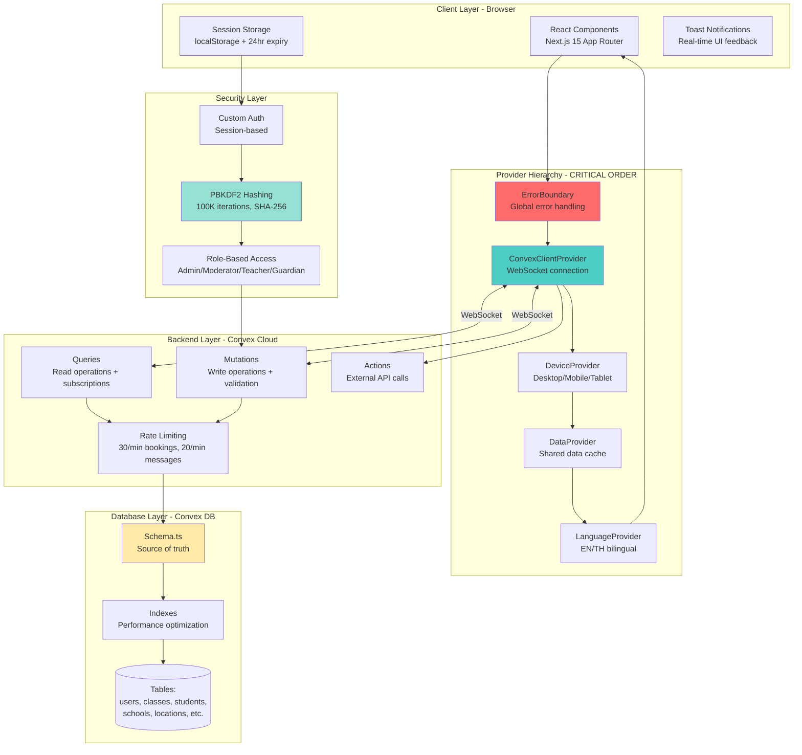
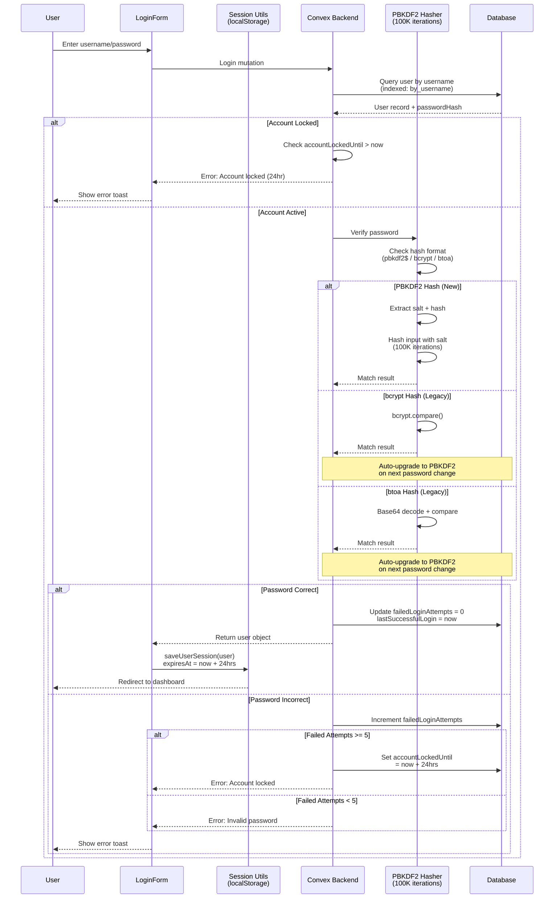
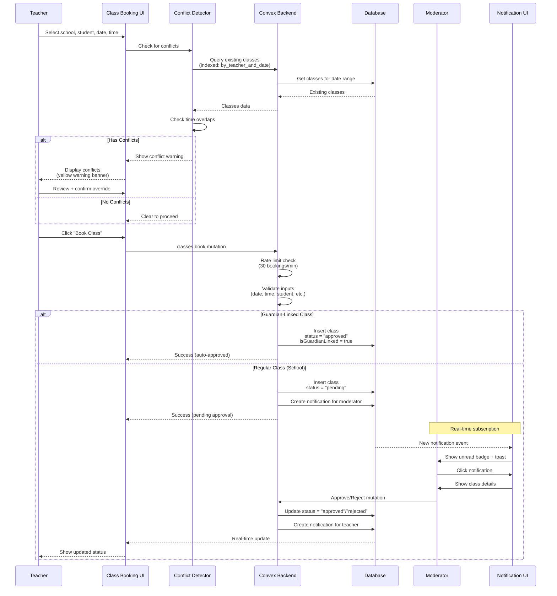
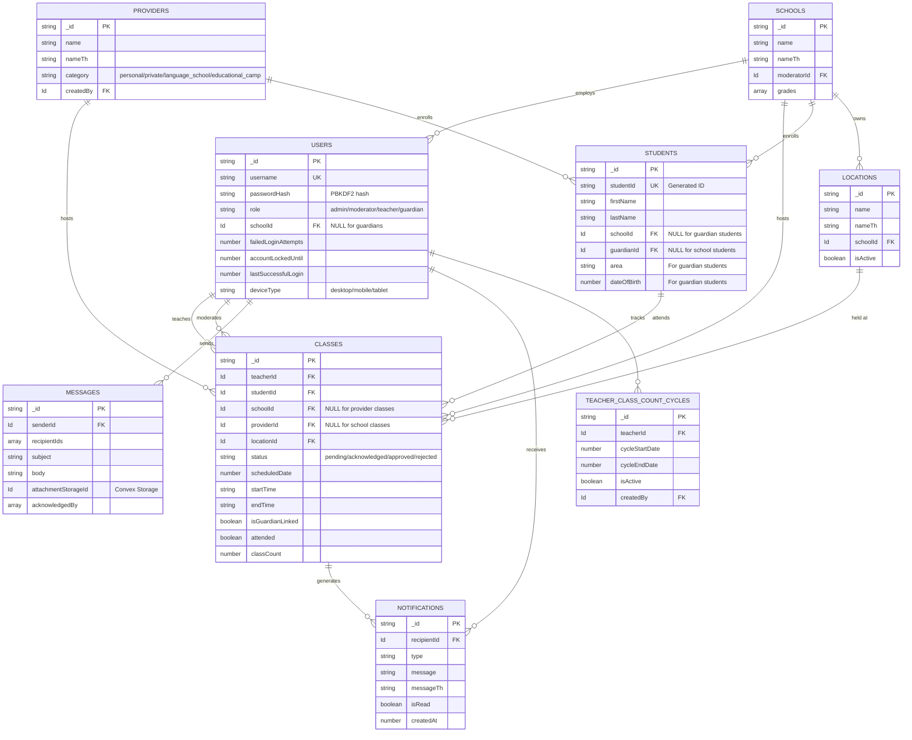
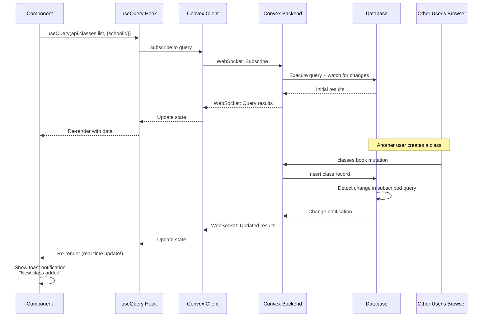
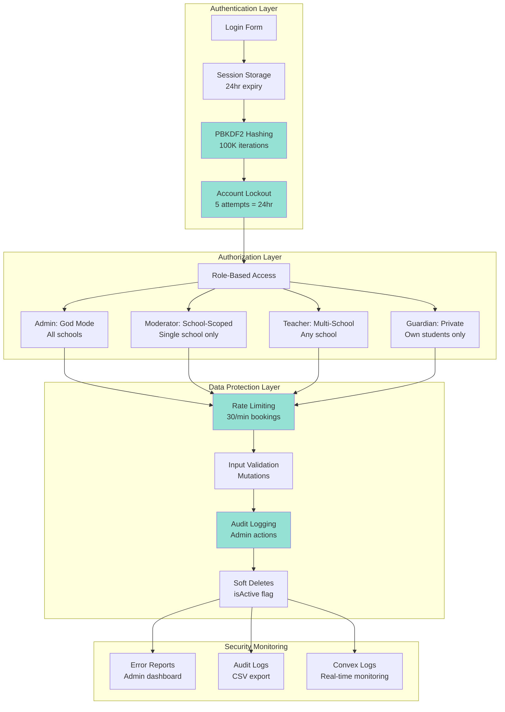
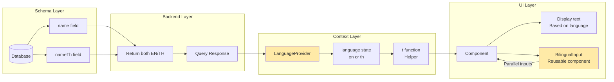
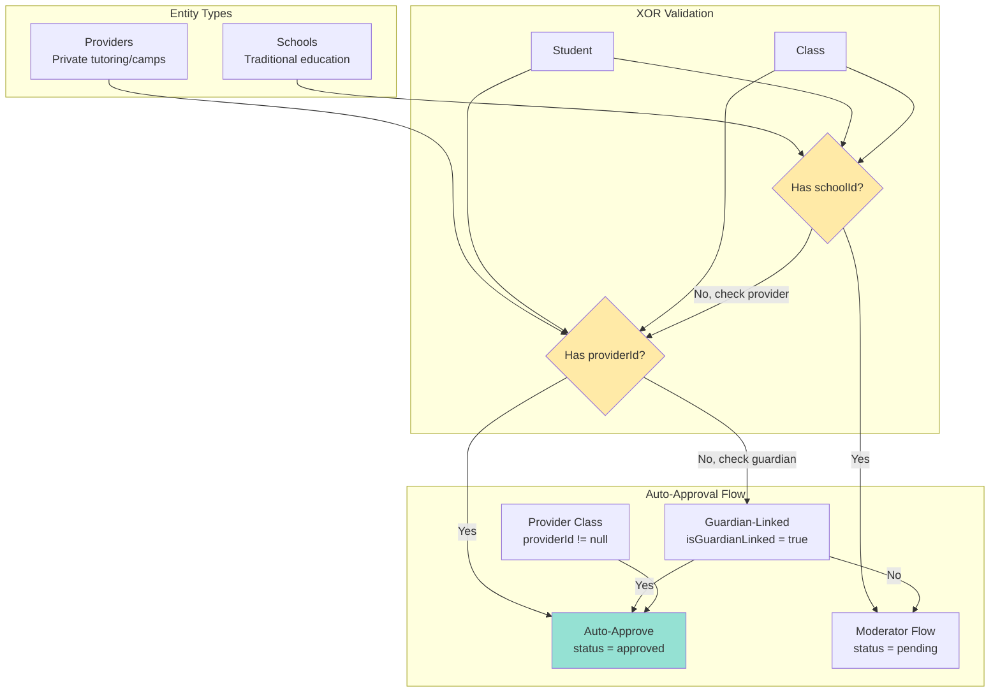

# System Architecture Diagram - Evan's Class Tracker 4.5

**Date**: November 2, 2025  
**Version**: 4.5.20 (PBKDF2 Security)  
**Purpose**: Visual reference for system architecture, data flow, and deployment

---

## 1. High-Level System Architecture



---

## 2. Authentication & Security Flow



---

## 3. Class Booking Data Flow



---

## 4. Database Schema Relationships



---

## 5. Real-Time Subscription Pattern



---

## 6. Deployment Pipeline

```mermaid
graph LR
    subgraph "Development - Local"
        Dev[Developer]
        Git[Git Repository<br/>GitHub]
        LocalConvex[Convex Dev<br/>npx convex dev]
        LocalNext[Next.js Dev<br/>npm run dev]
    end

    subgraph "CI/CD - GitHub Actions"
        Push[Git Push]
        CI[CI Workflow<br/>TypeScript + ESLint]
        E2E[E2E Tests<br/>Playwright]
        Deploy[Deploy Workflow]
    end

    subgraph "Production - Cloud"
        ConvexProd[Convex Cloud<br/>Backend + Database]
        VercelProd[Vercel<br/>Next.js Frontend]
        CDN[Vercel CDN<br/>Global Edge Network]
    end

    subgraph "Backup - MongoDB Atlas"
        Backup[Daily Backups<br/>npm run backup]
        MongoAtlas[(MongoDB Atlas<br/>Secondary storage)]
    end

    Dev -->|Code changes| Git
    Git -->|Webhook| Push
    Push --> CI
    CI -->|Pass| E2E
    E2E -->|Pass| Deploy

    Deploy -->|npx convex deploy| ConvexProd
    Deploy -->|vercel --prod| VercelProd
    VercelProd --> CDN
    CDN -->|HTTPS| Users[End Users]

    ConvexProd <-->|Real-time WebSocket| CDN
    ConvexProd -->|Daily export| Backup
    Backup --> MongoAtlas

    Dev -->|Local dev| LocalConvex
    Dev -->|Local dev| LocalNext
    LocalNext <-->|WebSocket| LocalConvex

    style ConvexProd fill:#4ecdc4
    style VercelProd fill:#000
    style MongoAtlas fill:#00ed64
```



---

## 7. Performance Optimization Patterns

```mermaid
graph TB
    subgraph "Query Optimization"
        Query[Database Query]
        Index[Check Index<br/>by_teacher_and_date]
        Batch[Batch Fetch Pattern<br/>Promise.all]
        Map[Map Lookup<br/>O1 access]
    end

    subgraph "Frontend Optimization"
        Component[React Component]
        Memo[useMemo<br/>Expensive calculations]
        Callback[useCallback<br/>Stable functions]
        Debounce[Debounce<br/>300ms input delay]
        Pagination[Pagination<br/>15 items per page]
    end

    subgraph "Network Optimization"
        RealTime[Real-time Updates<br/>WebSocket]
        Cache[DataProvider Cache<br/>Shared state]
        Skip[Conditional Queries<br/>"skip" parameter]
    end

    Query --> Index
    Index --> Batch
    Batch --> Map
    Map -->|Fast lookups| Component

    Component --> Memo
    Component --> Callback
    Component --> Debounce
    Component --> Pagination

    RealTime --> Cache
    Cache --> Skip
    Skip -->|Prevents unnecessary queries| Query

    style Index fill:#95e1d3
    style Map fill:#95e1d3
    style Pagination fill:#95e1d3
    style Cache fill:#95e1d3
```

**Performance Gains** (Oct 2025 optimizations):

- 40-50% faster page loads
- 10-100x faster queries (N+1 elimination)
- 85% DOM reduction (pagination)
- 64% memory reduction

---

## 8. Security Layers



**Security Grade**: A+ (PBKDF2 100K iterations across all password creation)

---

## 9. Bilingual Architecture



**Pattern**: Every user-facing string has English + Thai. Forms use `BilingualInput` component.

---

## 10. Provider System (NEW Oct 2025)



**Rule**: Students/Classes must have EITHER `schoolId` OR `providerId` (not both, not neither).

---

## Legend

| Color | Meaning |
|-------|---------|
| 🔴 Red | Critical/Error handling |
| 🔵 Blue | Data layer/Database |
| 🟢 Green | Security/Performance |
| 🟡 Yellow | UI/Context layer |
| ⚫ Black | External services |

---

## Related Documentation

- **Architecture Details**: `.github/copilot-docs/02-architecture.md`
- **Integration Points**: `.github/copilot-docs/04-integration.md`
- **Security**: `.github/copilot-docs/05-security.md`
- **Disaster Recovery**: `.github/copilot-docs/11-disaster-recovery.md`
- **Refactoring Guide**: `.github/copilot-docs/15-refactoring-guide.md`

---

**Last Updated**: November 2, 2025 (v4.5.20 - PBKDF2 Security)
